# Authentication UI Architecture Diagram

## 1. Component Hierarchy

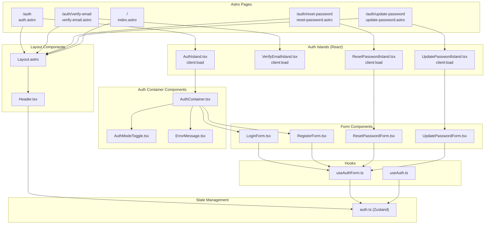

## 2. Authentication User Flows

### 2.1 Registration Flow

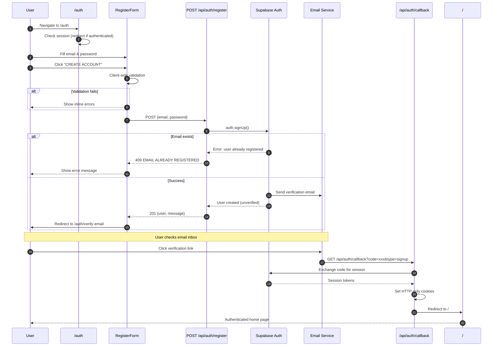

### 2.2 Login Flow

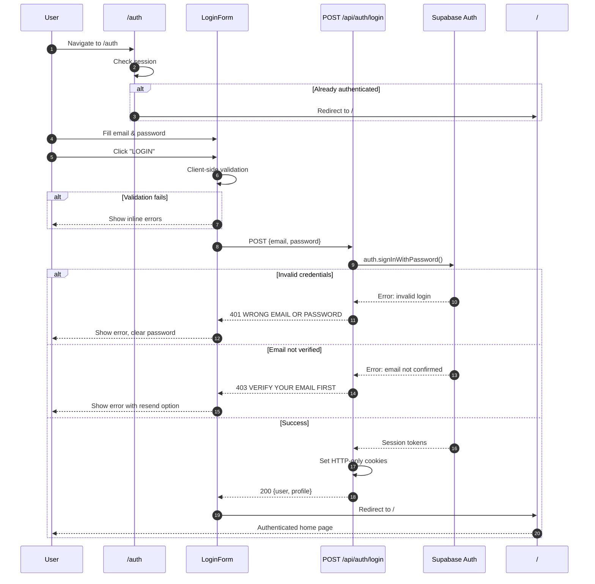

### 2.3 Password Reset Flow

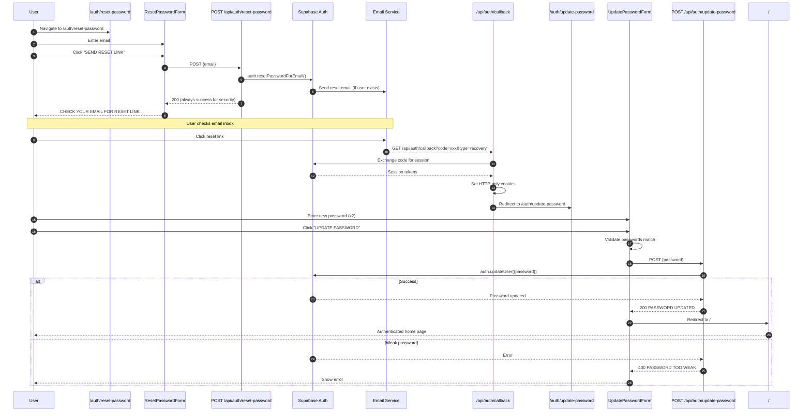

### 2.4 Logout Flow

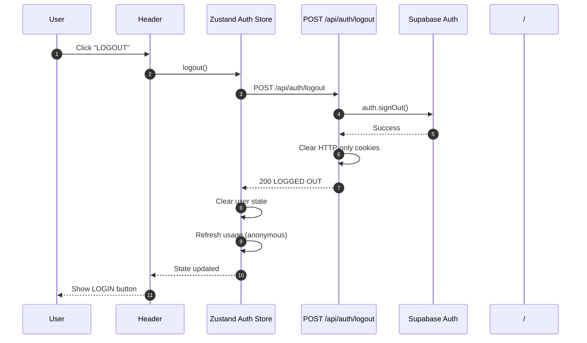

## 3. State Management

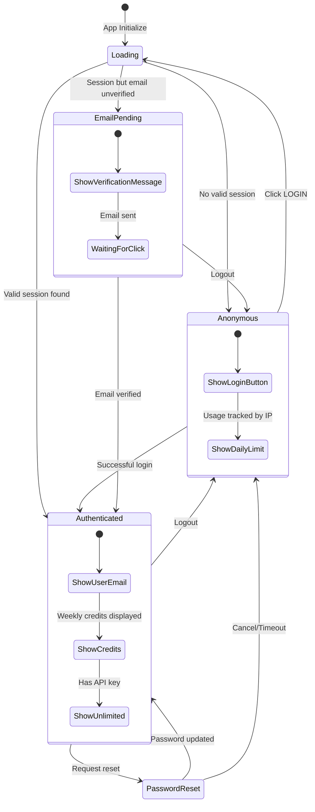

## 4. API Endpoint Architecture

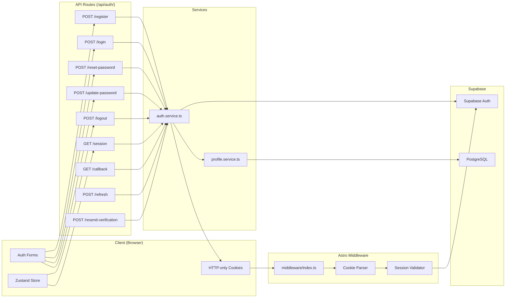

## 5. Form Validation Flow

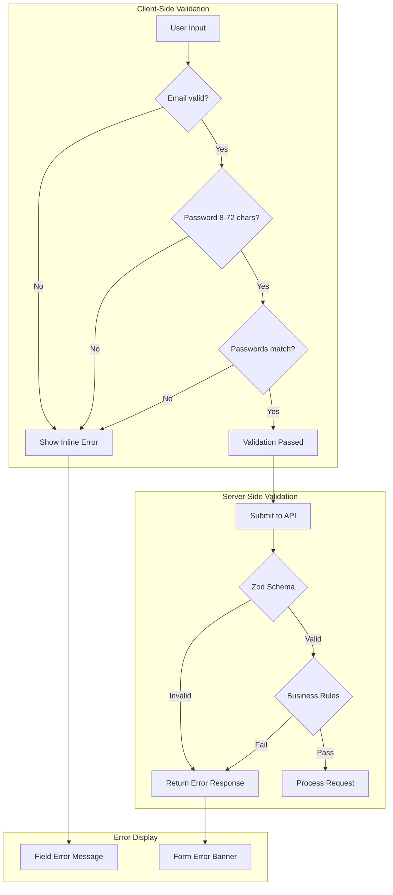

## 6. Cookie-Based Session Architecture

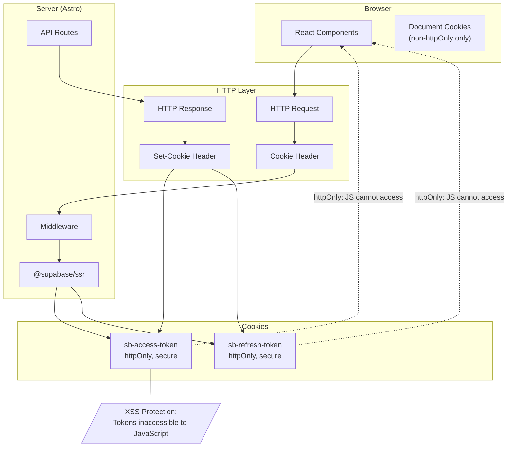

## 7. Protected Route Pattern

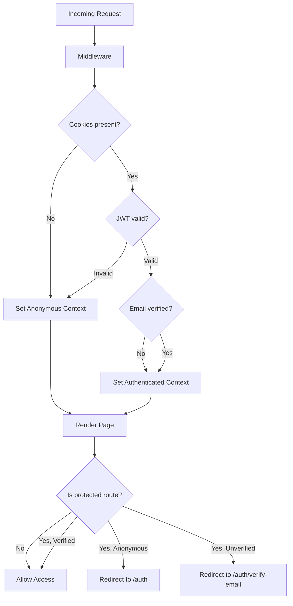

## 8. File Structure Overview

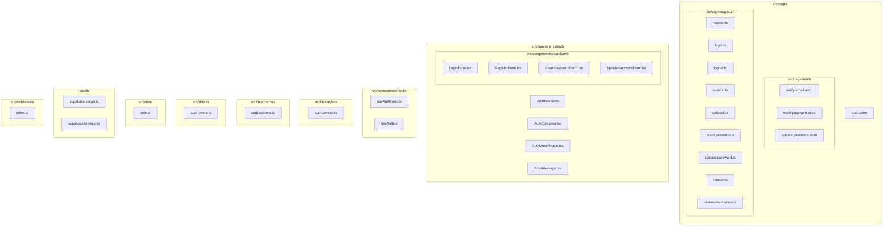

## 9. Error Handling Matrix

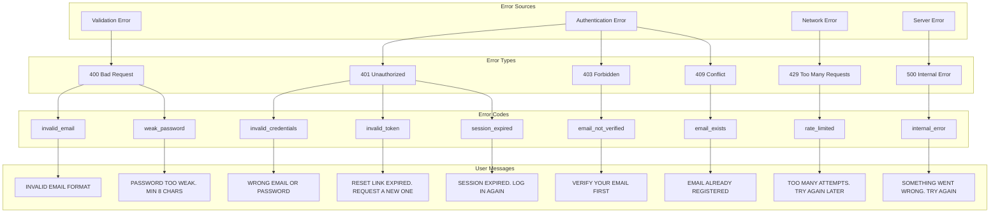
